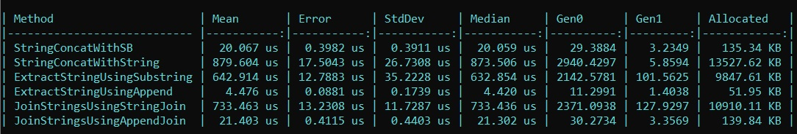
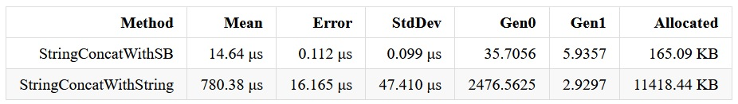

# StringVsStringBuilder
In diesem Projekt wird der Unterschied zwischen [String](https://learn.microsoft.com/en-us/dotnet/csharp/programming-guide/strings/) und [StringBuilder](https://learn.microsoft.com/en-us/dotnet/api/system.text.stringbuilder?view=net-8.0) in der Programmierspache [C#](https://learn.microsoft.com/de-de/dotnet/csharp/tour-of-csharp/) veranschaulicht.
Um das Programm auzuführen, sollte man in die CLI gehen und dort folgenden command eingeben:
`dotnet run --project StringVsStringBuilderDemo.csproj -c Release `

Es werden sechs verschiedene Funktionen auf deren Speicherverbrauch und Laufzeit getestet. 

	1.StringConcatWithSB()
	2.StringConcatWithString()
	3.ExtractStringUsingSubstring()
	4.ExtractStringUsingAppend()
	5.JoinStringsUsingStringJoin()
	6.JoinStringsUsingAppendJoin()

Am Ende erhält man eine Tabelle, die in der CLI ausgegeben wird.

Alternativ erzeugt es auch noch eine .html-, .csv- und .md-Datei.

Zum Testen der Funktionen wird das [BenchmarkDotNet-NuGet](https://benchmarkdotnet.org/articles/overview.html) verwendet.
